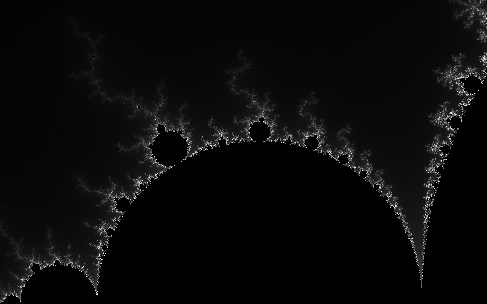

# Mandel



A monochromatic Mandelbrot renderer. It avoids annoying "rings" in the gradient
by using random stippling. I wanted to dabble in Rust, and I wanted to make fun
pictures. I managed both goals. Now I've used it to render my wallpaper.

### Use

[Install Rust.](https://www.rust-lang.org/tools/install)

```bash
git clone git@github.com:spejamchr/mandel.git && cd mandel
cargo run
```

### Configuration

Configuration is only available by editing the source. Open `src/main.rs`. The
rendering area & resolution can be specified by adjusting the call to
`mandelbrot()`in `main()`. There are some examples to help.
